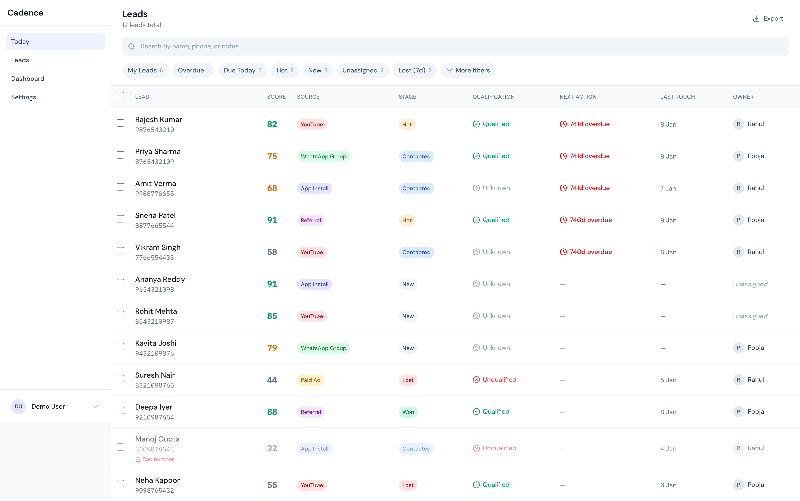

# Leads Section

The full lead database where BDs and founders can find any lead in seconds, understand their status at a glance, log outcomes from external calls, audit history, and clean data.

## Overview

- **Purpose**: Lookup-oriented lead management (vs. Today's queue-based calling)
- **Users**: BDs (their leads) and Founders (all leads)
- **Key UX**: Fast search, quick filter chips, data table with side panel details

## Key Features

### Search & Filter
- Full-text search by name, phone, or notes
- Quick filter chips: My Leads, Overdue, Due Today, Hot, New, Unassigned, Lost 7d
- Advanced filters drawer for complex queries

### Lead Table
- Columns: Lead (name + phone), Score, Source, Stage, Qualification, Next Action, Last Touch, Owner
- Multi-select with checkbox column
- Click row to open side panel

### Side Panel (Desktop) / Bottom Sheet (Mobile)
- Above-fold: Name, score, source, stage, phone, owner, qualification, next action
- Quick actions: Log Call, WhatsApp, Schedule, Send Link
- Activity timeline with expandable history
- Lead details (exam, attempt, city, language)
- Stage change dropdown
- Mark as bad number action

### Bulk Actions
- Assign owner
- Set qualification
- Mark bad number
- Export selected
- (Admin only): Move stage, Close lost

### Outcome Logging
- 3-layer disposition form inline in side panel
- Call result → Conversation outcome → Next action
- After save: toast notification, stay on current lead (lookup flow)

## Components

| Component | Description |
|-----------|-------------|
| `LeadsView` | Main container with table, filters, side panel |
| `LeadTableRow` | Table row with all columns and checkbox |
| `LeadDetailPanel` | Side panel with lead details and actions |
| `OutcomeForm` | 3-layer call outcome disposition form |

## Data Requirements

See `types.ts` for full interface definitions:
- `Lead` — Full lead record with timeline, flags, extra fields
- `User` — Team members for owner assignment
- `FilterCounts` — Counts for quick filter chips
- `TimelineEvent` — Call, link sent, stage change, note events
- `OutcomeFormData` — Form data structure for logging calls

## Design Patterns

### Desktop Layout
```
┌─────────────────────────────────────────────────────────────┐
│ Header: Title + Export                                      │
│ Search bar                                                  │
│ Quick filter chips                                          │
├─────────────────────────────────────────────────────────────┤
│ Bulk actions bar (when selected)                            │
├─────────────────────────────────────────────────────────────┤
│ Lead Table                    │ Side Panel                  │
│ ☐ Name/Phone Score Source ... │ Name + Score + Stage        │
│ ☐ Rajesh...   82   YT    ... │ Phone + Copy                 │
│ ☐ Priya...    75   WA    ... │ Owner | Qualification        │
│ ...                           │ Next Action (if any)         │
│                               │ [Log Call] [WA] [Sched] [Link]│
│                               │ Recent Activity              │
│                               │ Lead Details                 │
│                               │ Move Stage                   │
│                               │ [Open full] [Mark bad #]     │
└─────────────────────────────────────────────────────────────┘
```

### Mobile Layout
- Full-width table (horizontally scrollable)
- Bottom sheet for lead details on tap

## Screenshots


